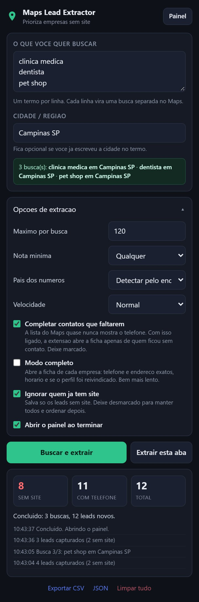
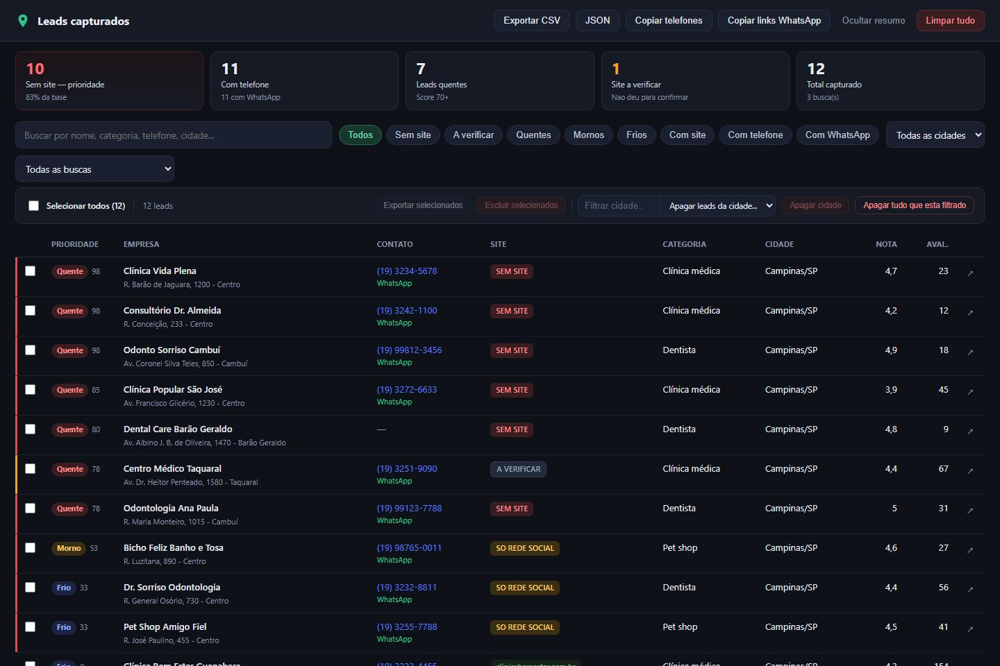

# Extrator de Leads — Maps Lead Extractor

**Extensão de navegador que extrai leads do Google Maps e coloca automaticamente as empresas sem site
no topo da lista.** Nome, telefone, site, endereço, nota, link de WhatsApp pronto e um score de
prioridade comercial, tudo exportável em CSV e JSON.

JavaScript puro, Manifest V3, sem build e sem dependências. Funciona em Chrome, Brave, Edge e Opera.

> **EN** — A browser extension that scrapes business leads from Google Maps and automatically ranks
> businesses **without a website** at the top: those are the ones you call first. Phone, website,
> address, rating, ready-made WhatsApp link and a 0–100 priority score, exported as CSV or JSON.
> Plain JavaScript, Manifest V3, no build step. [English section below.](#english)

| Popup de controle | Painel de leads |
|---|---|
|  |  |

---

## Sumário

- [O que a ferramenta faz](#o-que-a-ferramenta-faz)
- [Instalação](#instalação)
- [Como usar](#como-usar)
- [O que é capturado](#o-que-é-capturado)
- [A regra de priorização](#a-regra-de-priorização)
- [Como o telefone e o site são obtidos](#como-o-telefone-e-o-site-são-obtidos)
- [WhatsApp de qualquer país](#whatsapp-de-qualquer-país)
- [Painel de leads](#painel-de-leads)
- [Opções de extração](#opções-de-extração)
- [Estrutura do projeto](#estrutura-do-projeto)
- [Se o Google mudar o layout](#se-o-google-mudar-o-layout)
- [Testes](#testes)
- [Limites e uso responsável](#limites-e-uso-responsável)
- [English](#english)
- [Licença](#licença)

---

## O que a ferramenta faz

Você digita o que quer buscar ("clínica médica", "dentista", "pet shop") e a cidade. A extensão abre
o Google Maps, executa cada busca uma depois da outra, rola a lista inteira, captura todos os
estabelecimentos e abre um painel com os leads já ordenados por prioridade: **quem não tem site vem
primeiro**, porque é exatamente a fila de quem você vai ligar para vender um site.

Tudo roda dentro do seu navegador. Nenhum dado sai da máquina.

### Por que JavaScript puro, sem build

O Google Maps não expõe esses dados por uma API pública gratuita. Eles existem no DOM da página e
nas respostas de rede que a própria página baixa. Então o extrator precisa rodar *dentro* da aba do
Maps, e isso só um content script de extensão faz. Não há TypeScript, bundler nem `npm install`: os
arquivos do repositório são os que o navegador carrega. Qualquer ajuste é editar o arquivo e clicar
em recarregar.

---

## Instalação

Leva dois minutos e não precisa instalar nada além do navegador.

**1. Baixe o projeto**

```bash
git clone https://github.com/GustavoN-S/extrator-de-leads.git
```

Ou clique em **Code → Download ZIP** e descompacte em uma pasta.

**2. Abra a página de extensões** colando na barra de endereço:

| Navegador | Endereço |
|---|---|
| Google Chrome | `chrome://extensions` |
| Brave | `brave://extensions` |
| Microsoft Edge | `edge://extensions` |
| Opera | `opera://extensions` |

**3. Ligue o "Modo do desenvolvedor"** (chave no canto superior direito).

**4. Clique em "Carregar sem compactação"** e selecione a pasta do projeto (a pasta que contém o
`manifest.json`, não um arquivo de dentro dela).

**5. Fixe o ícone na barra**: clique na peça de quebra-cabeça ao lado da barra de endereço e no
alfinete ao lado de "Maps Lead Extractor".

> No Opera pode aparecer "Instale extensões do Chrome". Não é necessário. O "Carregar sem
> compactação" já resolve.

**Depois de editar qualquer arquivo:** volte em `chrome://extensions`, clique no botão de recarregar
no card da extensão e aperte **F5** na aba do Google Maps. Os dois passos são necessários, porque o
content script precisa ser reinjetado na página.

---

## Como usar

### Busca pela própria extensão

1. Clique no ícone da extensão.
2. Em **O que você quer buscar**, digite os termos, um por linha:
   ```
   clinica medica
   dentista
   pet shop
   ```
3. Em **Cidade / região**, digite onde: `Campinas SP`.
4. A extensão mostra o preview do que vai buscar:
   `3 busca(s): clinica medica em Campinas SP · dentista em Campinas SP · ...`
5. Clique em **Buscar e extrair**.

O Google Maps abre sozinho, um painel flutuante aparece no canto da página mostrando o progresso
(quantos leads entraram, quantos sem site, log ao vivo e botão **Parar**), e ao terminar o painel de
leads abre com a lista pronta. A extração roda na aba, não no popup, então dá para fechar o popup.

Para o primeiro teste, coloque **Máximo por busca: 20** nas opções.

### Extrair uma busca que você já abriu

Se você já está com uma busca aberta no Maps, inclusive com filtros ou área do mapa ajustados na
mão, clique em **Extrair esta aba**.

---

## O que é capturado

| Campo | Observação |
|---|---|
| Empresa | nome do estabelecimento |
| **Tem site** | `SIM` / `NÃO`, o critério de priorização |
| Site | URL quando existe |
| Telefone | mais link `tel:` e link de **WhatsApp** pronto |
| Categoria | ex.: "Clínica médica" |
| Endereço / Cidade-UF | cidade e UF são separadas automaticamente |
| Nota e nº de avaliações | |
| Perfil reivindicado | quando a ficha é aberta |
| Horário | |
| Latitude / Longitude | extraídas da URL do lugar |
| Link do Google Maps | abre a ficha original |
| Busca de origem | qual termo trouxe esse lead |
| Data/hora da captura | |

---

## A regra de priorização

A lista é ordenada assim, nessa ordem:

1. **Quem não tem site vem primeiro**, sempre, independente de score.
2. Maior **score** primeiro.
3. Quem tem telefone antes de quem não tem.
4. Ordem alfabética.

O score (0–100) decide quem ligar primeiro dentro do grupo sem site:

| Sinal | Pontos |
|---|---|
| Sem site nenhum | **+55** |
| Só Instagram, Facebook, Linktree ou similar | +10 |
| Tem telefone (dá para ligar hoje) | +18 |
| Perfil não reivindicado no Google | +12 |
| Menos de 30 avaliações (negócio pequeno) | +8 |
| Nota 4,0 ou mais | +5 |
| Já tem site próprio | **−25** |

Faixas: **Quente** 70+ · **Morno** 40–69 · **Frio** abaixo de 40.

**Instagram não conta como site.** Uma empresa cujo "site" no Maps é um `instagram.com/...` ou
`linktr.ee/...` continua sendo lead: ela não tem presença própria. Aparece marcada como
`SÓ REDE SOCIAL`.

Para mudar os pesos, edite `GMX.WEIGHTS` em `src/shared/constants.js`. A lista de domínios que
contam como rede social está em `GMX.SOCIAL_HOSTS`, no mesmo arquivo.

---

## Como o telefone e o site são obtidos

É a parte mais delicada do extrator. Ele trabalha em três camadas:

**1. Resposta de rede do próprio Maps (principal).** O card da lista quase nunca desenha o telefone
na tela, mas a resposta que o Maps baixa para montar a lista já traz telefone e site de cada empresa.
A extensão escuta essa resposta e lê os dados dela.

**2. Leitura do DOM.** Varre o card procurando link `tel:`, o campo de telefone e qualquer link que,
depois de desembrulhado, seja um site de empresa válido. O Maps entrega o site embrulhado num
redirect (`google.com/url?q=SITE_REAL`); é preciso desembrulhar antes de decidir se o link é do
Google ou da empresa, senão o site real é descartado e a empresa aparece como "sem site" por engano.

**3. Abrir a ficha (rede de segurança).** Quem ficou sem telefone ou sem confirmação de site tem a
ficha aberta automaticamente (opção **Completar contatos que faltarem**, ligada por padrão).

### "SEM SITE" x "A VERIFICAR"

Campo de site vazio é ambíguo: pode ser "a empresa não tem site" ou "não consegui ler". Tratar os
dois como a mesma coisa marcaria empresa **com** site como se não tivesse. Por isso cada lead
carrega um selo de verificação:

| No painel | Significa |
|---|---|
| `SEM SITE` (vermelho) | Confirmado: a empresa realmente não tem site |
| `SÓ REDE SOCIAL` (amarelo) | Só tem Instagram, Facebook ou Linktree. Continua sendo lead |
| domínio (verde) | Tem site próprio |
| `A VERIFICAR` (cinza) | Não deu para confirmar. **Não** conte como "sem site" |

A afirmação "não tem site" só é feita a partir de duas fontes confiáveis: a ficha da empresa, ou a
resposta de rede quando o campo de site pode ser lido. O card da lista só gera afirmação quando
**encontra** um link de site; não encontrar nada nele não prova nada.

**Autoconferência do campo de site.** O site vem de uma posição fixa no JSON da resposta. Se o
Google mudar essa posição, a extensão leria "vazio" para todo mundo. Para evitar isso, a cada
resposta ela confere: se nenhum estabelecimento daquela resposta tem site na posição esperada, a
posição mudou, então nada é afirmado e todos vão para confirmação pela ficha.

**Hosts do Google nunca contam como site.** `search.google.com`, `business.google.com`,
`maps.google.com`, `goo.gl`, `g.co` e os CDNs são infraestrutura do Google. As únicas exceções são
construtores de site reais: `sites.google.com` e `*.business.site`.

### Conferir o que está sendo lido

Com a lista aberta no Maps, aperte `F12` e rode no console:

```js
GMX.diagnose()
```

Mostra quantas respostas de rede foram lidas, quantos telefones e sites vieram delas, o contador da
autoconferência (`siteIndexOk` / `siteIndexBad`) e o que o extrator lê do primeiro card.

---

## WhatsApp de qualquer país

O telefone do Maps vem em formato local. O WhatsApp exige E.164: só dígitos, com o código do país e
sem o zero nacional. A extensão faz essa conversão para **96 países**, com Europa e América do Norte
completas.

| Como aparece | País | Link gerado |
|---|---|---|
| `(11) 98765-4321` | Brasil | `wa.me/5511987654321` |
| `(305) 555-1234` | EUA | `wa.me/13055551234` |
| `020 7946 0958` | Reino Unido | `wa.me/442079460958` (cai o `0`) |
| `030 12345678` | Alemanha | `wa.me/493012345678` (cai o `0`) |
| `01 42 68 53 00` | França | `wa.me/33142685300` |
| `912 345 678` | Portugal | `wa.me/351912345678` |
| `8 495 123-45-67` | Rússia | `wa.me/74951234567` (o `8` vira `7`) |
| `+351 912 345 678` | qualquer | usa o código que já veio |

De onde sai o código do país, nessa ordem:

1. O próprio número, quando já vem com `+`
2. A opção **País dos números** no popup, se você fixar um
3. O nome do país no endereço ou na busca ("dentista em Lisboa, Portugal")
4. Brasil, como último recurso

Buscando fora do Brasil, fixe o país nas opções. É o resultado mais confiável.

---

## Painel de leads

Abre sozinho ao terminar, ou pelo botão **Painel** no popup.

- Linha com **faixa vermelha à esquerda** = sem site. Faixa amarela = a verificar.
- Cinco KPIs no topo: sem site, com telefone, quentes, site a verificar, total.
- Filtros rápidos: *Sem site*, *A verificar*, *Quentes*, *Mornos*, *Frios*, *Com site*,
  *Com telefone*, *Com WhatsApp*.
- Filtro por cidade, por busca de origem e busca livre por nome, categoria, telefone ou cidade.
- Clique num cabeçalho para reordenar. O terceiro clique volta para a ordenação de prioridade.
- Seleção múltipla para exportar ou excluir só os selecionados.
- Exclusão em massa por cidade ou de tudo que está filtrado.
- **Copiar telefones** e **Copiar links WhatsApp** jogam a lista no clipboard, pronta para colar em
  discador ou CRM.

### Exportações

- **CSV**, separado por `;` e com BOM, então abre direto no Excel em português sem bagunçar acentos.
  Para usar vírgula, mude `csvDelimiter` em `src/shared/constants.js`.
- **JSON**, para importar em CRM ou automação.
- **Telefones** e **links de WhatsApp** como texto puro no clipboard.

O CSV já sai na ordem de prioridade: os sem site nas primeiras linhas.

---

## Opções de extração

| Opção | O que faz |
|---|---|
| **Máximo por busca** | Teto de resultados por termo (padrão 120). O Google costuma limitar a lista em cerca de 120 por busca; para pegar mais, quebre por bairro ou cidade. |
| **Nota mínima** | Descarta abaixo da nota escolhida. |
| **País dos números** | Código de país usado no WhatsApp quando o telefone vem sem `+`. Deixe em *Detectar pelo endereço* no Brasil; fixe o país ao prospectar no exterior. |
| **Velocidade** | Lenta, Normal ou Rápida. Em lote grande, prefira Lenta. |
| **Completar contatos que faltarem** | Abre a ficha apenas de quem ficou sem telefone ou sem confirmação de site. Ligada por padrão. |
| **Modo completo** | Abre a ficha de cada empresa: telefone e endereço exatos, horário e se o perfil foi reivindicado. Muito mais lento (cerca de 2 s por empresa), bem mais preciso. |
| **Ignorar quem já tem site** | Só entram na base leads sem site. O filtro roda na hora de gravar, então também remove o lead se o site só aparecer depois, ao abrir a ficha. Desmarque para guardar todos e deixar os com site no fim da lista. |
| **Abrir o painel ao terminar** | |

O modo rápido já diz com segurança se a empresa tem site ou não, que é o que você precisa para
priorizar. Use o **Modo completo** quando quiser os telefones de todo mundo com precisão máxima, ou
o dado de "perfil não reivindicado".

---

## Estrutura do projeto

```
extrator-de-leads/
├── manifest.json                 Manifest V3
├── icons/                        Ícones 16 / 32 / 48 / 128
├── src/
│   ├── shared/                   Usado por todas as partes
│   │   ├── constants.js          Campos, pesos do score, padrões, mensagens
│   │   ├── phone.js              E.164 de 96 países e link de WhatsApp
│   │   ├── scoring.js            Score e ordenação de prioridade
│   │   ├── store.js              chrome.storage e deduplicação
│   │   └── export.js             CSV, JSON e lista de telefones
│   ├── background/
│   │   └── service-worker.js     Fila de buscas, navegação da aba, persistência, badge
│   ├── content/                  Roda dentro da página do Maps
│   │   ├── netcapture.js         Escuta as respostas de rede do Maps (mundo da página)
│   │   ├── netparse.js           Lê telefone e site dessas respostas
│   │   ├── selectors.js          Mapa único de seletores do DOM
│   │   ├── dom.js                Esperas, scroll, clique real
│   │   ├── parsers.js            Telefone, nota, lat/lng, CID, endereço
│   │   ├── extract.js            Lê um estabelecimento do DOM
│   │   ├── overlay.js / .css     Painel flutuante de progresso
│   │   └── scraper.js            Auto-scroll e orquestração
│   ├── popup/                    Painel de controle (campo de busca e opções)
│   └── dashboard/                Painel de leads
├── tools/
│   ├── make-icons.ps1            Regenera os ícones (PowerShell)
│   ├── smoke-test.cjs            Score, parsers, CSV, deduplicação
│   ├── test-contatos.cjs         Telefone e site
│   ├── test-internacional.cjs    Máscara de 96 países, cidade, verificação
│   ├── test-painel.cjs           Lógica do painel sobre um DOM mínimo
│   └── test-site.cjs             Decisão "tem site ou não" ponta a ponta
├── docs/screenshots/             Imagens deste README
└── LICENSE                       MIT
```

Todo o código compartilhado vive no namespace `GMX`, carregado como script clássico no content
script, no service worker (via `importScripts`), no popup e no painel.

---

## Se o Google mudar o layout

É o risco natural de qualquer extrator de Maps. Por isso **todos os seletores estão num arquivo
só**: `src/content/selectors.js`. Cada campo aceita uma lista de alternativas e usa a primeira que
casar:

```js
detailWebsite: [
  'a[data-item-id="authority"]',
  'a[data-tooltip="Abrir site"]',
  'a[data-tooltip="Open website"]'
],
```

Sempre que dá, o código usa atributos semânticos (`role`, `aria-label`, `data-item-id`) em vez das
classes embaralhadas do Google, que mudam muito mais. Para consertar: abra o Maps, `F12`, inspecione
o elemento, adicione o seletor novo no início da lista e recarregue a extensão.

---

## Testes

Os testes rodam em Node, sem navegador, carregando os módulos num contexto isolado:

```bash
node tools/smoke-test.cjs
node tools/test-contatos.cjs
node tools/test-internacional.cjs
node tools/test-painel.cjs
node tools/test-site.cjs
```

São 164 verificações cobrindo score, ordenação, parsers (telefone, nota, lat/lng, CID, endereço),
geração de CSV, deduplicação, desembrulho do redirect de site, leitura do payload de rede, máscara
internacional de telefone e a lógica de filtro, seleção e exclusão do painel. A camada de leitura do
DOM não é coberta, porque depende da página real do Google; para essa parte use `GMX.diagnose()`.

---

## Limites e uso responsável

- O Google entrega no máximo cerca de 120 resultados por busca. Para varrer uma cidade inteira,
  quebre em bairros ou termos mais específicos e deixe a fila de buscas rodando. A deduplicação
  cuida das repetições.
- Vá com calma em volume alto: use a velocidade Lenta e evite centenas de buscas seguidas na mesma
  sessão.
- A ferramenta lê dados de empresas que já são públicos no Google Maps. Ao usar os contatos, respeite
  a LGPD e a legislação local: identifique-se, diga como conseguiu o contato e atenda pedidos de
  descadastro.

---

## English

### Overview

**Maps Lead Extractor** is a browser extension that scrapes business listings from Google Maps and
turns them into a prioritised call list. Its core rule: **businesses without a website go to the
top**, because they are the ones you call first if you sell websites or digital services.

For each business it captures the name, phone, website, category, address, city, rating, review
count, opening hours, coordinates, the Google Maps link and the search term that found it. It then
computes a 0–100 priority score (no website +55, has phone +18, unclaimed profile +12, fewer than 30
reviews +8, rating 4.0+ +5, social-media-only "website" +10, has a real website −25) and sorts the
list: no website first, then score, then phone availability, then name.

Phone numbers are converted to E.164 for **96 countries** so every lead gets a working
`wa.me/...` WhatsApp link. A dedicated dashboard offers filters (no site, unverified, hot, warm,
cold, with phone, with WhatsApp), city and search-term filters, multi-select, bulk delete, and
export to CSV (Excel-friendly), JSON or a plain phone list.

The extension distinguishes **"NO SITE"** (confirmed by the business page or the network payload)
from **"UNVERIFIED"** (could not be confirmed), so a business with a website is never mislabelled.
Instagram, Facebook and Linktree links do not count as a website.

Everything runs inside your browser. No data leaves your machine. Plain JavaScript, Manifest V3,
no build step and no dependencies.

### Installation

Takes two minutes. Nothing to install besides the browser.

1. **Download the project**
   ```bash
   git clone https://github.com/GustavoN-S/extrator-de-leads.git
   ```
   Or click **Code → Download ZIP** and unzip it.
2. **Open the extensions page** by pasting into the address bar:

   | Browser | Address |
   |---|---|
   | Google Chrome | `chrome://extensions` |
   | Brave | `brave://extensions` |
   | Microsoft Edge | `edge://extensions` |
   | Opera | `opera://extensions` |

3. **Turn on "Developer mode"** (toggle in the top-right corner).
4. **Click "Load unpacked"** and select the project folder (the one containing `manifest.json`).
5. **Pin the icon**: click the puzzle-piece icon next to the address bar, then the pin next to
   "Maps Lead Extractor".

After editing any file: go back to `chrome://extensions`, click the reload button on the extension
card and press **F5** on the Google Maps tab. Both steps are needed.

### Quick start

1. Click the extension icon.
2. Type the search terms, one per line (e.g. `dentist`, `pet shop`).
3. Type the city or region (e.g. `Boston MA`).
4. Optionally open **Extraction options** and set **Max per search** to 20 for a first run. When
   prospecting outside Brazil, set **Phone country** to the country you are targeting.
5. Click **Search and extract**.

Google Maps opens by itself, a floating panel shows live progress, and when the run finishes the
leads dashboard opens with the list already sorted by priority. To scrape a search you already have
open in Maps, use **Extract this tab** instead.

The interface is in Portuguese. All labels are plain strings in `src/popup/popup.html`,
`src/dashboard/dashboard.html` and `src/content/overlay.js`, so translating is straightforward.

### Tests

```bash
node tools/smoke-test.cjs
node tools/test-contatos.cjs
node tools/test-internacional.cjs
node tools/test-painel.cjs
node tools/test-site.cjs
```

164 checks run in Node without a browser, covering scoring, sorting, parsers, CSV generation,
deduplication, website redirect unwrapping, network payload parsing, international phone masks and
the dashboard filtering logic.

### Responsible use

Google returns at most about 120 results per search; split large areas into neighbourhoods. Use the
slow speed for big batches. The tool reads business data that is already public on Google Maps.
When contacting leads, follow local privacy law (LGPD, GDPR, CAN-SPAM), identify yourself and honour
opt-out requests.

---

## Licença

Código sob a licença [MIT](LICENSE).

Feito por [GustavoN-S](https://github.com/GustavoN-S).
